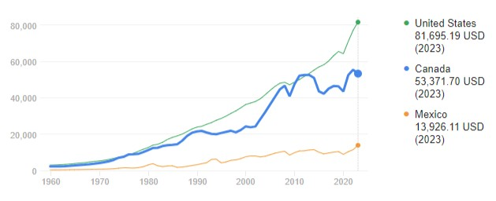
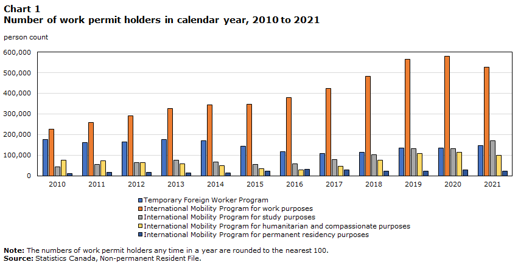
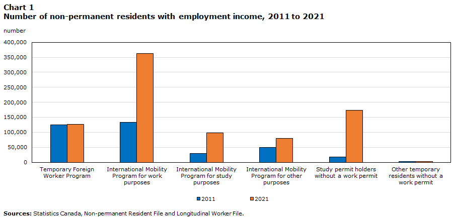

Когда я слышу, как люди повторяют мантры “стране нужны иммигранты, потому что у нас физически не хватает посудомоек, сварщиков, медсестер”, то у меня случается разрыв шаблона и возникает ощущение, что меня дурят. И вот почему. Разговор про Северную Америку, но в Европе, наверное, ситуация похожая.

Профессионалов этих специальностей можно подготовить за два-три года или меньше. Я могу понять, когда их “не хватает” в плановой экономике - ну не рассчитали, надо строить новые пту и медучилища, и лет через цать получим на выходе сварщиков и медсестер. А в рыночной экономике подготовка таких кадров совсем не вопрос. Вопрос лишь в цене труда.

Если кто-то из владельцев бизнеса на рынке металлоконструкций жалуется на нехватку сварщиков, то это лишь означает, что на рынке труда мало желающих варить за предлагаемую жалобщиком зарплату, и что на рынке мало желающих платить за этот труд больше, чем жалобщик. Люди, которые потенциально могли бы варить швы - есть, но они выбрали себе другое дело, например: тыкать в клавиши, варить латте, втирать про равенство. Если ты не смог их уговорить варить швы за предлагаемую тобой зарплату, то ты хреновый бизнесмен и иди работать за зарплату, а не проси у власти дешевую рабсилу. Рынок-с.

Еще раз, крупным шрифтом: **люди есть, но у частных (не у государственных!) работодателей не получается заставить их работать за деньги, которые обе стороны считают приемлемыми**.

## Как так получилось?

А почему так получилось, что люди не хотят варить швы, а предпочитают варить латте? Да по чисто экономическим причинам, а не потому, что они ленивые, много о себе думают, у них лапки - нужное подчеркнуть. Потому, что не видят смысла.

В другом тексте ([где про бээлэмы](../2020-12-31-how-did-we-end-up-here/) я уже упоминал это: условные миллениалы/GenZ из среднего класса в среднем получает за свой труд меньше ништяков, чем их отцы или деды. Когда я говорю “ништяки”, я имею в виду жилье, еду, транспорт и другие необходимые вещи, а не тыквенный латте, нетфликс и доставку пиццы на дом в два часа ночи. В качестве доказательства привожу голубых воротничков: в 60-80 годы один такой кормилец содержал неработающую жену и детей, и это было очень распространенное явление, в том числе в больших и средних городах. В 2024 году такой фокус возможен лишь в местах с очень низкой стоимостью жизни, то есть в дырах, где, как правило, работы для этих голубых воротничков немного. Если тут мне начнут возражать “ну открой свой бизнес, нанимай сварщиков, и будешь в шоколаде” то дискуссия наша заканчивается, бо мы говорим о наемных работниках, которые профессионалы в чем-то одном. А то эдак мы быстро дойдем до мемного “Can’t find a job? Learn to code!”.

У условных миллениалов/GenZ мотивация реализовать себя в семье и любимой голубоворотничковой работе заметно ниже, чем в 60-80е. Поэтому они выбирают другой путь: без детей, без своего дома (жить с родителями тоже нынче нормально), с ненапряжной работой, которая позволяет платить по счетам и за некоторые удовольствия типа ресторана раз в месяц, нетфликса и путешествия в соседний город на автобусе. А когда они слышат, как старшее поколение говорит им, что, мол, работай, как мы, не трать деньги на авокадо тост, и все у тебя будет, как у нас, то они предлагают старшему поколению выпить свои таблетки и посмотреть вокруг незамутненным взором. Не будет у нас, как у вас. Работа, как вы ее понимаете, на выходе не дает нам домика с детьми и женой-домохозяйкой. Нету больше этой вашей американской мечты, забудьте уже.

Тут обычно начинаются стоны: мол, у нас экономика не развивается из-за нехватки неквалифицированных рабочих и голубых воротничков. Ребята, **если люди не хотят идти в посудомойки и сварщики за предлагаемые зарплаты, то это значит, что ваша экономика в них не очень-то и нуждается. Если бы была острая нужда - зарплаты там были бы выше.** А статус-кво с армией офисного планктона и барист - всего лишь отражение экономических реалий. Налогового режима, например, который в Северной Америке, как и в большинстве стран, вообще не поощряет экономическую активность.

## Какое решение нам предлагают?

С местными разобрались. Теперь посмотрим на приезжающих. Для начала - если они сварщики или медсестры, то им придется тут подтвердить свои умения местным дипломом (работа всерую - отдельный разговор). То есть в начале пути они присоединяются к армии посудомоек, доставщиков пиццы, разнорабочих на стройках. Солдаты этой армии готовы годами жить в условиях, которые большинство местных считают для себя неприемлемыми. Именно так образуются иммигрантские гетто. Именно эти люди и приехавшие за ними родственники моментально выстраиваются в очередь за бесплатным супом, бесплатной медициной (если такая есть), субсидированным жильем, создавая нагрузку на и без того трещащую по швам социальную систему. Еще раз - не потому, что они такие злобные-жадные-хитрые, а просто потому, что их сюда пустили легально (в Канаде и в Европе) или нелегально (в штатах), чтобы они “восполнили нехватку рабочих рук” за зарплату, которая фактически не обеспечивает прожиточного минимума. То есть за дешевую рабсилу, которую государство подогнало бизнесу, общество расплачивается разбухшей социалкой, меньшими налоговыми поступлениями (зарплата же ниже) а потом почти сразу - возросшим уровнем бытовой преступности, потому как у парней из гетто выбор действительно небогатый. Выигрывают частные работодатели, проигрывают налогоплательщики.

Еще раз, крупным шрифтом: **если вы хотите получить в стране людей, готовых работать за вознаграждение, которое не обеспечивает не то что домика с лужайкой и домохозяйкой, а элементарно достойного прожиточного минимума, то будьте готовы компенсировать им недостачу другими путями.** Ну не бывает чудес.

Ну ладно рядовой обыватель, донести до него эту простую причинно-следственную связь не всегда (мягко говоря) возможно. Но что же демократически избранное правительство? Почему (на дворе 2024 год) в штатах запускают нелегалов через южную границу, в Европе дают зеленый свет тучам “беженцев”, а [в Канаде абсолютно легально завозят пачками “временных” работников и раздают ПМЖ небывалыми темпами](../../en/2025-05-01-canadian-immigration-patterns/)? Хоть мне с каждым годом все труднее, я пытаюсь все объяснить:
- элементарными идиотизмом,
- коррупцией
- стремлением освоить бюджеты

не прибегая к рептилоидам и прочей мировой закулисе.

Сначала про идиотизм. Будем считать (да, это допущение), что люди в среднем за последние сто лет не поглупели и не поумнели. Но. Экономический бум, одним из сигналов которого был dotcom bubble, показал, что умные люди в наше время способны неплохо зарабатывать множеством способов в частном бизнесе (как владельцы и как наемные работники), а во власть идут… не самые умные. Чисто субъективно этот тезис подтверждает даже поверхностное наблюдение за политиками в штатах и в Канаде. Ну стыдоба же, не? Ну а те, кто во власти поумнее, оседлали бюджетные потоки и тихо строят (да уже построили) свой маленький коммунизм.

В Европе слегка другой перекос, там в евробюрократии путем естественного отбора оказались самые хитрые, которым больших миллионов не надо, а достаточно приличной зарплаты и пенсии. То есть тут явно доминирует бюджетный фактор.

Ну и везде коррупция (в основном по мелочи), типа унылого наркомана байдена-младшего.

Так вот, не исключено что т.н. “элиты” (если у них IQ хотя бы, например, 120, что тоже далеко не факт) прекрасно понимают негативные последствия завоза дешевой рабсилы, но им тупо начхать. У них есть KPI в виде GDP, на него и ориентируются, его и предъявляют в качество доказательства своей эффективности. И горизонт планирования у них максимум два избирательных цикла (если их вообще выбирают - yes, Europe, I am looking at you). И они (пока что) относительно успешно избегают ответственности с помощью креативных экономических мер - я имею в виду QE в частности и соотношение Debt/GDP вообще. То есть банкет продолжается за счет будущих поколений налогоплательщиков.

Так что от властей тут сочувствия и помощи не дождаться.

## "Вы не понимаете, они не дают нашей экономике заглохнуть!"

Традиционный аргумент защитников дешевой иностранной рабсилы: экономика - это игра с ненулевой суммой, в конечном итоге от дешевой рабсилы все выигрывают. Отвечаю графиком канадской GDP per capita из Гугла:

Так себе тренд. Провал на графике около 2015 года совпадает с приходом к власти Трюдо и объяснений можно найти множество. Посмотрим на количество людей с разрешениями на работу.

https://www150.statcan.gc.ca/n1/pub/36-28-0001/2023010/article/00003-eng.htm :

или https://www150.statcan.gc.ca/n1/pub/11-631-x/11-631-x2024006-eng.htm :

Если от дешевой иностранной рабсилы “все выигрывают”, то GDP per capita должен был взлететь, но случилось наоборот. **То есть игра действительно с ненулевой суммой, но не в ту сторону.** То есть все эти замечательные профессионалы, которых Канада завозит, как-то плохо работают и не подстегивают наш GDP.

Если подумать, то ситуация с GDP per capita на самом деле еще хуже, чем показано на первом графике. Дело в том, что при подсчете используется продукт, произведенный иностранными работниками, но при этом сами они не считаются "населением", они же временные. То есть они добавляют в числитель (GDP), но не добавляют в знаменатель (population). Их количество за последние годы выросло в разы, их доля в общем населении страны существенно возросла, так что при текущей методике подсчета GDP per capita сравнивать 2011 год с 2021 - можно, конечно, но надо понимать, что в 2021 году показатель оказывается больше "поддут" за счет увеличившейся армии временных работников.

## Альтернативы?

Если не рассматривать серьезные экономические преобразования (а запроса на таковые я не наблюдаю ни среди элит, ни среди обывателей Северной Америки; сумасшедшие социалистические заходы не в счет), то в качестве альтернативы обычно дружно показывают на Японию. Они, мол, тоже не рожают, они не завозят дешевую рабсилу (это, кстати, похоже, меняется) и поэтому у них все плохо. Да, йена тут ослабела (за долги приходится платить), и японцы это почувствовали. Но практически все мои знакомые, скатавшиеся туда туристами или временными работниками, без ума от страны. Знаю одну японскую семью, которая в прошлом году после 30 лет переездов по всему миру (и весьма успешных карьер), включая Северную Америку, абсолютно осознанно вернулась в Японию. Меня пугают, что у них там некому вытирать сопли старичкам, и поэтому старичкам предлагают эвтаназию, на что я отвечаю, что в моей Канаде эвтаназию уже несколько лет предлагают всем подряд и уже есть добровольцы, про которых пишут в газетах.

Я это все к тому, что относительно молодого и неглупого обывателя в Северной Америке (не берусь судить про Европу) сегодня трудно напугать какой-то Японией, когда:
- у него крайне туманные перспективы по части семьи, детей, работы
- он наблюдает, как ему подобных замещают приезжими, которые либо готовы работать за гораздо меньшие деньги либо не собираются работать вообще
- его уровень жизни неуклонно падает, и пример с благополучием отцов и дедов отошел в область легенд
- в районе, где он вырос, становится опасно ходить после заката

Да, он видит, что японский GDP per capita с середины девяностых не показывает блестящих результатов. Но канадский (с ее бешеными темпами иммиграции) уже лет десять топчется на месте, европейцы тоже не очень радуют, так что вся надежда на штаты с их статусом резервной валюты. В общем, он видит, что условный Запад скатывается в сценарий, чем-то напоминающий японский, но при этом в Японии отсутствует инвазивная фауна. И Япония выглядит не так уж и страшно.

Более реалистичная альтернатива - Сингапур, где сейчас живет 3.64m граждан, 0.5m на ПМЖ и 1.86m работающих в поте лица экспатов. Секрет успешной сингапурской модели привлечения внешней рабочей силы прост: рабочая виза (employment pass - EP) лишь первый маленький шаг на пути в сотни ли к ПМЖ, и не гарантирует ну вообще ничего, в то время как в Канаде и странах Европы рабочая виза - это гигантский шаг к ПМЖ. В Канаду едут работать или учиться, чтоб получить канадский паспорт, а в Сингапур едут именно что работать и жить. А демографические вопросы Сингапур пытается решать прямым импортом людей из Малайзии и Китая, на манер американской green card lottery. К этой системе тоже могут быть вопросы, но она, по крайней мере, очень четко контролируется (как и большинство общественных процессов в Сингапуре).

## А если рассмотреть (серьезные) экономические преобразования как альтернативу?
Совсем необъятная тема. Для начала было бы неплохо понять, в какой момент окончательно стало ясно, что один добытчик из голубых воротничков не может прокормить семью с домиком, и что к этому привело. Точно не в этом посте. Одна из причин - [так называемый “жилищный кризис”](../2025-05-01-so-called-housing-crisis/).