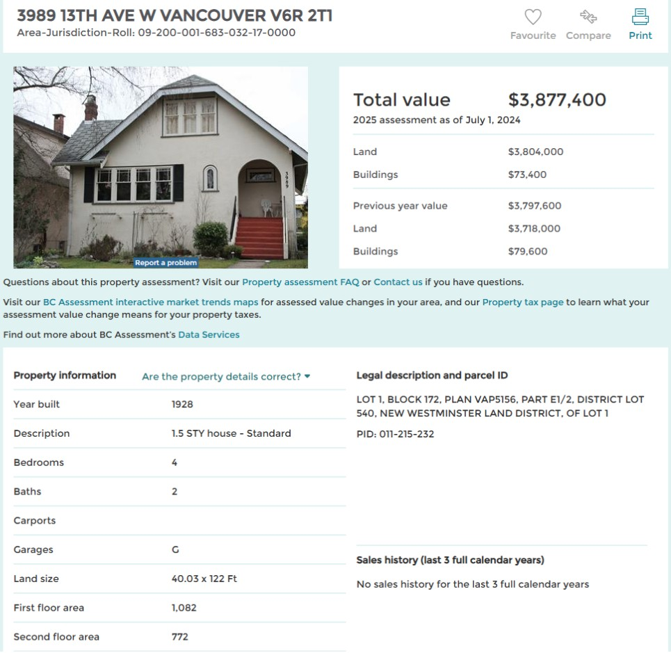
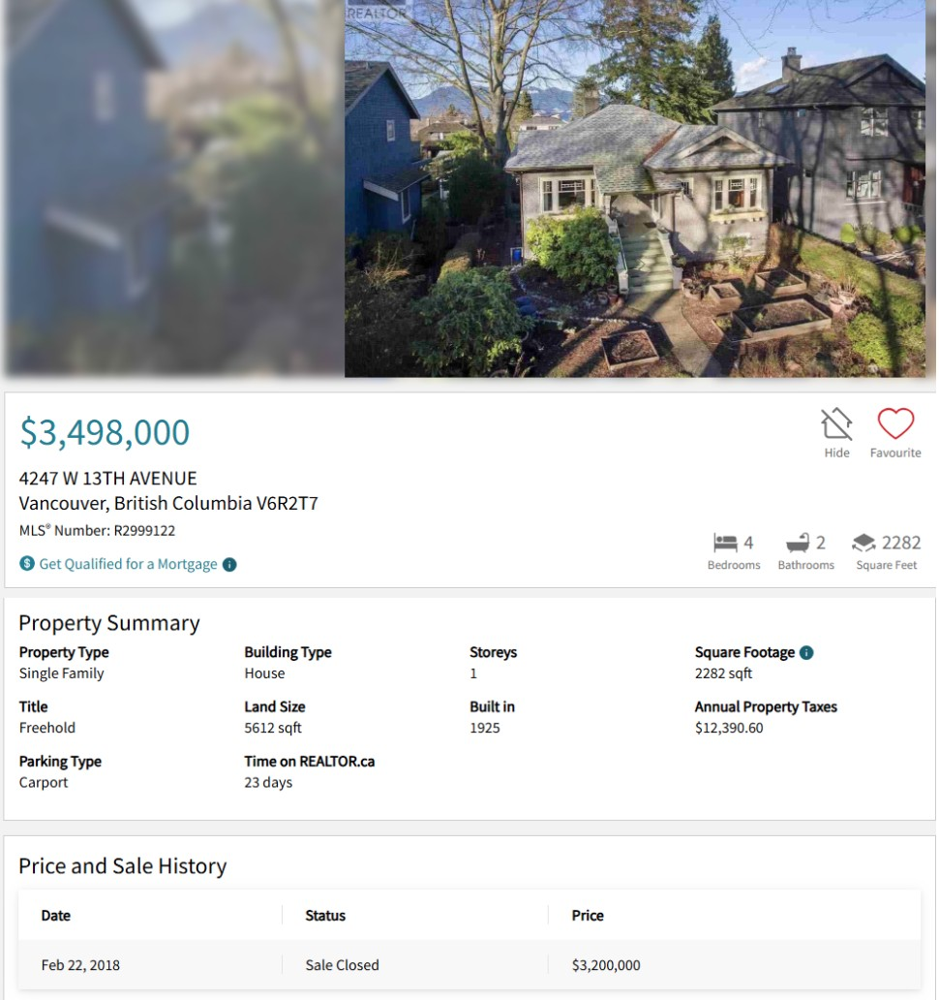

[Текст про “нехватку рабочих рук”](../2024-08-01-who-will-pick-the-cotton) заканчивается вопросом про радикальные экономические изменения. Посмотрев очередной ютюбовский ролик с плачем Ярославны про цены на недвижимость и аренду, собрался, наконец, сформулировать. Ролик был про Португалию с ее золотыми визами, цифровыми кочевниками и краткосрочной арендой, но феномен почти всемирный, поэтому к конкретной стране попробую не привязываться. Хотя примеры мне удобнее всего приводить из Канады.

## Собственно, плач

Часть населения, а конкретнее - условная молодежь, не владеющая жилой недвижимостью, жалуется на высокие цены при покупке и аренде жилья. Графики приводить нет смысла, информация вся на слуху и в интернете. В Канаде “доступное жилье” уже давно вовсю в предвыборных обещаниях. Счастливые владельцы недвижимости (включая отчаянных ипотечников) понимающе кивают плачущим, но стараются особого внимания к себе не привлекать. Владельцы “инвестиционной” недвижимости стараются вообще не отсвечивать, но готовы биться за свои права собственников насмерть. И всех можно понять.

## By design

Ну плачут. И да, я сочувствую плачущим (правда, без иронии). Но плач этот слышу уже лет 20, поэтому особого внимания ему не придаю. А вот когда в хоре плачущих начинает проскакивать, что, мол, система поломана, ее как-то надо чинить, людям негде жить, то я просыпаюсь, потому как у меня есть что сказать.

Сразу, без предисловий: **система не сломана, а работает в точности как задумано**, и во всех странах примерно одинаково. Разжевываю по шагам.

### Раз: Большую часть цены недвижимости составляет земля, на которой она стоит

Например, уродец в неплохом для своего возраста состоянии по адресу 3989 13th Ave W Vancouver BC оценивается в 2024 году в $73,400 CAD, и участок в 4.5 сотки, на котором он стоит - в $3,804,000 CAD (см. картинку в конце текста). Да, бывает и так, что на таком участке ставят новый дом с ванной, отделанной итальянским мрамором, и соотношение будет не таким большим. Например, постройка соседа по адресу 3982 на очень похожем участке оценивается в $1,766,000 CAD. Но, надеюсь, вы поняли мысль - в 2025 году для покупатель или арендатор **всегда вынужден иметь дело с дорогим куском земли**.

### Два: При текущем налоговом режиме земля является средством накопления и сохранения капитала

Важно: именно накопления и сохранения. И именно земля, а не постройки. Конечно, есть люди, которые на этой земле выращивают картоху, строят жилищные комплексы,  развлекательные центры и заводы по производству всякой фигни, содержат на этой земле приличные гостиницы и качественные доходные дома. Честь им и хвала. Но у огромного числа землевладельцев (в Канаде точно) стратегия гораздо более простая: купил, подождал пока вырастет, продал. Или не продал, а оставил как есть потомкам.

Почему такая стратегия стала возможной? В двух словах: **содержание куска земли стоит ничтожно мало по сравнению с потенциальной прибылью при продаже, а делать на земле серьезный бизнес рискованно и хлопотно**. В качестве примера гуглите, скажем, “Vancouver slumlords” - владельцы трущоб десятилетиями сдают аварийные малоэтажки малоимущим почти что не тратясь на содержание. Другой пример - асфальтовые (не многоярусные и не подземные!) стоянки посреди небоскребов: содержание минимум, а земля под асфальтом набирает цену. Или совсем интересно: особо ленивый владелец такой асфальтовой стоянки засыпает ее щебнем и объявляет “площадкой для выгула собак” или просто предлагает окрестным жителям разбить там огородики и растить помидоры (не шутка) - в обоих случаях кусок земли получает статус “общественного парка” и вопрос с налогами снимается. Самое смешное, что местные жители при этом радуются, как дети - бесплатно же!

Другой пример: [Майорка, пустые дома в глубине острова](https://www.youtube.com/watch?v=fkOFq5qGAwQ) на 18:30, и почти трущобы на 7:00 и 26:00. И все твердят про “жилищный кризис”. Сталкивание лбами злых лендлордов и злых сквоттеров.

### Три: плачущие нищеброды не могут конкурировать с “инвесторами” в землю

Тут совсем просто. Гуглим “Bill Gates buys farmland”. Или дословно “Buy land, Chip. Buy land.” То есть когда у бизнесмена, коррупционера или бандита появляется пара лишних миллионов, то земля - прекрасный кошелек, чтоб ее придержать и с большой вероятностью перепродать подороже. И у плакальщиков, работающих за зарплату просто нет шансов при такой конкуренции.

### Четыре: огромная часть избирателей не хочет менять статус-кво

Владельцы выплаченного жилья радуются жизни: в Северной Америке годовые налоги на недвижимость по сравнению с оценочной стоимостью неприлично маленькие (самый большой в Нью-Джерси около 2.5%, в Ванкувере сильно ниже 1%). Например, другой уродец по соседству на 4247: в мае 2025 продается за $3,498,000 CAD при налоговом ценнике $12,390 CAD в год (см. в конце текста).

Платящие ипотеку рвутся пополнить ряды выплативших или радуются низкому проценту, который им повезло поймать. Желающие купить - принимают правила игры и с готовностью берут ипотеку. И все они рассматривают недвижимость как свой личный пенсионный фонд, которому в 2025 году практически нет альтернативы: бизнеса вести не они умеют, фондовый рынок их пугает, проценты на депозите мизерные, а вот недвижимость “у меня никто не отберет”.

И их можно понять. В наших странах нет достойных пенсий от государства (бюрократы не в счет) и нету возможности “накопить” на эту самую пенсию, ну не сходится тут никакая математика. Если всем этим людям сказать, что недвижимость перестанет быть средством сохранения и накопления капитала, то они будут сильно волноваться. С избирателями так нельзя.

## Ну, за справедливость!

Тут иногда к плачущим подбегают активисты левого толка и заводят любимую песню про неравенство. Мол, мы вам сочувствуем, это возмутительно, всему виной неравенство, давайте с ним бороться. Но нас с вами, выходцев с одной шестой части суши, лучше не агитировать за равенство, поэтому мне опять надо вмешаться.

У меня есть сосед. Живет он довольно скромно, вежлив, приветлив. И есть у него страстишка - он коллекционирует машинки. Не бог весть что, не Феррари, но пара поршей и пара заряженных бэх у него в конюшне есть. По бытовым нуждам ездит на обычном джипе рэнглере. Налицо неравенство между ним и многими другими соседями. Но. Этот условный богатый сосед не конкурирует с условными бедными соседями
за ресурсы: землю, воду, воздух.

Если вдруг ему завтра захочется поставить дома золотую ванну весом в пять тонн, никто из окружающих в радиусе десяти тысячи километров не пострадает ни капельки. Более того, даже живущий за десять тысяч километров другой любитель золотых ванн при этом не почувствует ухудшения качества жизни: у него по-прежнему будет та же крыша над головой,  и тот же набор поесть, попить и подышать. Ну повременит с покупкой новой золотой ванны, подумаешь.

А если сосед вместо золотой ванны решит прикупить себе жилой недвижимости на такую же сумму (полмиллиарда USD на сегодня), то он начнет конкурировать с толпой плачущих, и с большой вероятностью выиграет соревнование.

В этом и разница. Само по себе финансовое неравенство не несет угроз. Неудобства начинаются, когда неравенство в деньгах влечет за собой заметное ухудшение качества жизни для проигравших. И не беда, если условные богатые вдруг раскупят все машины, и бедным не на чем ездить - рынок отреагирует и с радостью увеличит производство машин, в какой-то момент условные богатые сдадутся и перестанут их скупать. А вот если условные богатые скупили землю, водные акватории, воздух, недра, доступ к солнечному свету (например, противный Маск настроил в небе кучу солнечных батарей и у меня из-за этого помидоры не растут и недостаток витамина Д) - вот тогда действительно, может сложиться революционная ситуация.

То есть нужно четко представлять разницу между продуктом человеческого труда и ограниченным природным ресурсом. **Человек должен иметь полное право распоряжаться продуктами своего труда (да, желательно без налогов), но право распоряжаться тем, что дадено свыше “задаром” должно идти рука об руку с компенсацией тем, кто в результате был лишен правом пользования этими “дарами”.**

А неравенство это ваше - как винтовка. Если он у меня стоит дома в сейфе, и я по выходным стреляю из неё в тире, и раз в году езжу с ней на охоту - да пожалуйста. А если я открываю окно и начинаю из этой винтовки понижать качество жизни окружающих, не давая им спать и ходить в магазин за хлебом, и вообще реализовывать их право на достойную жизнь, то общество от этого точно здоровее не становится.

### Как так получилось?

А дошли мы до жизни такой очень просто. Сапиенсы распространялись по планете и в какой-то момент некоторые из них стали объявлять землю своей собственностью. Сначала право собственности подкреплялось силой, потом подвели под это дело юридическую базу. Объяснение было относительно разумным: если я на этой земле произвожу продукт (“осваиваю” землю), то я делаю доброе для человечества дело и мне нужны гарантии, что всякие жулики не отберут у меня “освоенное”. Земли было до хрена, и ни о какой компенсации окружающим за невозможность пользоваться этим куском земли речи не шло. Если не нравится - вали отсюда. Ну валили, пока было куда: американцы двигали фронтир, русские шли за Урал, всякие англичане-испанцы-португальцы плавали. Если встречали непонимание среди местного населения, которое частную собственность на землю не изобрело, то снова включалась сила.

А потом земля кончилась. То есть оказалось, что каждый квадратный метр кому-то принадлежит: ковбою Вилли, государству Канада, королю или его вассалу, рязанскому мужику. И привычка “осваивать” осталась, а вопрос о компенсации тем, кому “осваивать” нечего, как-то не поднимали. И через несколько столетий идея ставить под сомнение безвозмездное пользование землей стала уделом маргиналов.

Даже те, кто называют себя либертарианцами (["royal libertarians"](https://geolib.com/essays/sullivan.dan/royallib.html), I am looking at you), как правило не покушаются на эту священную корову.

_Да-да, свобода личности, свободный рынок, а вот право собственности на мой участок без финансовых обязательств перед остальными надо признать, это другое. Как почему? Потому что я его купил. У того-то, а тот у того-то, а тот пришел на эту землю, она была “ничья” и он ее “освоил”. Нет, тот первый не получил ее от Бога с запиской “это тебе”, он ее просто “застолбил”. Да, это относится не только к земле, а ко всем ресурсам. Вон надысь Peter Brabeck-Letmathe who served as Nestlé's CEO from 1997 to 2008 высказался в том духе, что, мол, неплохо бы и воду застолбить:_

>_"It's a question of whether we should privatize the normal water supply for the population. And there are two different opinions on the matter. The one opinion, which I think is extreme, is represented by the NGOs, who bang on about declaring water a public right. That means that as a human being you should have a right to water. That's an extreme solution. The other view says that water is a foodstuff like any other, and like any other foodstuff it should have a market value. Personally, I believe it's better to give a foodstuff a value so that we're all aware it has its price, and then that one should take specific measures for the part of the population that has no access to this water.”_

_А вы вообще случайно не коммунист? А а то странные вы вопросы задаете._

Понятно, что Нестле быстро сдала назад и “это не то, что вы подумали”. И что нам еще далековато до антиутопий в стиле “Продавец воздуха” советского фантаста Беляева. Но общий вектор пока именно такой.

## Carthago delenda est

### Деньги в земле

Итак, в результате имеем **налоговый режим, который демотивирует экономическую активность (налоги на индивидуальный доход, прирост капитала, корпоративный, с продаж) и поощряет пассивное владение природными ресурсами**.

Недавно слышал жалобы из Швейцарии, мол, на счетах у многих швейцарцев лежат миллионы, из-за этого другим жизни нет. Сами по себе эти миллионы не проблема для экономики. Но. При эффективном налоговом режиме банк, используя эти эти депозиты, раздавал бы бизнес-кредиты и экономика бы перла как на дрожжах. А вместо этого банк раздает ипотеку под мизерный процент, то есть эти миллионы служат механизмом для обмена кусками земли почти без создания товара и услуг. Фактически эти миллионы постоянно оказываются закопаны то на одном куске земли, то на другом, и принимают минимальное участие в производстве товара и услуг (ну да, иногда на этих кусках земли что-то строят, и агенты берут комиссионные, но это мелочь по сравнению со стоимостью собственно земли). В этом неэффективность, а не в том, что "у швейцарцев деньги лежат в банках".

### О “доступном” жилье

Правительства разной степени левизны изобретают кривые и хлипкие костыли в виде налоговых льгот для покупателей недвижимости, налогов на пустые дома, налогов для иностранных покупателей. Кто бы им объяснил, что **при текущем налоговом режиме нельзя получить “доступное жилье” кроме как прямым вмешательством в рынок** на манер берлинских квартир в управлении государства, но это глухой тупик, и он уже в пешей доступности.

Еще раз: **при текущем налоговом режиме, если оставаться в рамках рыночной экономики, то “доступное жилье” - это оксюморон вроде “доступные акции гугла” или “доступные золотые слитки”**.

### Владельцы тоже плачут

Тут обычно включается стройный хор живущих в собственном жилье (“инвесторы” благоразумно помалкивают): мол, дак как вы смеете так говорить, это не только “инвестиция”, это “место, где я и моя семья живут” (я не смог найти удачного перевода слова shelter, извините). Может быть, это и shelter. Но и инвестиция, так что на жалость давить не надо. Те, кто жилье снимают - для них недвижимость действительно shelter, и они имеют моральное право так о ней говорить. Они ее не используют в качестве investment vehicle. А вы, дорогие владельцы, используете. И вопросов к вам нет, пока вы не заводите свой собственный плач Ярославны на тему “ах, я, мол, house-rich and cash-poor” и “это, конечно, инвестиция, но продать я ее не могу, потому что это не акции гугла, а это другое”.

Тут вы меня теряете. Не можете содержать свою недвижимость из-за налогов или возросшей ипотечной ставки - продавайте. Как любили выговаривать лет 20 назад тем, кто не мог себе позволить жилье: if you can’t afford a home in this city - move somewhere else. То же самое можно сказать и владельцам: нет денег на содержание дома - съезжайте из него. Не хотите продавать задешево? Ну дык это рынок и это ваша “инвестиция”, никаких гарантий вам никто не давал. Если уж говорить о сочувствии, то мои симпатии на стороне снимающих жилье - у них нет иного выбора, кроме как зарабатывать больше и платить, что требует хозяин, а у вас выбор есть: хотите - зарабатывайте больше и содержите свой дом, а хотите - продавайте. В ответ обычно слезы - “а где же моя семья будет жить, если я буду вынужден продать дом? Не отбирайте у нас крышу над головой! Все имеют право на крышу над головой!” Эдакое моментальное переобувание в воздухе: investment -> shelter. Но, ребята, если вы считаете, что “отбирать у вас жилье”, которое вы не в состоянии содержать - это некрасиво, то как это вяжется с вашими амбициями “инвестора”? Мол, то я “инвестор”, а то я “нуждающийся в крыше над головой”. И так ad infinitum.

Другая жалостливая песня - “если цены на недвижимость упадут, то это ударит по среднему классу”. Для меня всегда был загадкой термин “средний класс”, у него нет четкого определения. Но даже если мы примем “интуитивное” определение - “не богач, но и не нищеброд”, то у меня стойкое ощущение, что в Северной Америке этот самый средний класс быстро вымирает. Если еще не вымер. То есть население все больше распадается на тех, кому можно не работать совсем (накопленный капитал, отданный в управление, позволяет), и на тех, чье финансовое положение варьируется от “жалкое” до “неустойчивое”. И **основная причина - это коммодитизация жилья как следствие текущего налогового режима и искусственно заниженной учетной ставки** (fed rate, prime rate etc). Покупателям жилья и земли приходится конкурировать с условными Блэкроком, покупающим жилую недвижимость и Биллом Гейтсом, покупающим сельхозугодья (см. пункт “три” выше). Понятно, кто в этом соревновании побеждает. И нетрудно видеть, что **мантра “обрушение рынка жилой недвижимости убьёт средний класс” выгодна именно Блэкроку и Гейтсу**.

Delenda est: **Существующий налоговый режим больше не соответствует современным вызовам и должен быть пересмотрен**.

## И чё делать?

А ничё не делать. Человечество еще не готово что-то менять. То есть дело не в злобных рептилоидах, а в миллиардах сапиенсов, многие поколения которых прожили с такой установкой и другой веры не знают. Ну когда совсем прижмет, тогда, может, зачешутся.

Поколение, которое недавно получило право голоса (условные GenZ и миллениалы), пока так и не поняло, где его обманули, и ищет успокоения в объятия левых этатистов (и успокаивает ноющую совесть на протестах за все хорошее). [Вот эта девушка Валя из Powell River](https://www.youtube.com/watch?v=PE6OEpz0xyQ) на 59:50, когда ее спрашивают, что она думает насчет передачи части земли на берегу моря от частников индейцам, с улыбкой отвечает, что ей, в общем, пофиг, так как у нее такого участка земли никогда не будет. Еще раз: **в самых что ни на есть канадских городках подросло поколение, которому пофиг эта ваша “неприкосновенная частная собственность на землю”**. Это сильный сигнал, по-моему.

Миллениалы постарше заняты детьми, ипотекой и скаканием по работам, не теряя надежды на хотя бы полуобеспеченную старость. GenX медленно вкатывается в пенсионный возраст, приглядывая за каждой копеечкой, в том числе и вложенной в землю. Бумеры просто в восторге, жизнь удалась.

Вся надежда на сегодняшних условных пятиклашек - систему начнет трясти по-крупному примерно тогда, когда они получат доступ на избирательные участки. Неточно, конечно, но надо же какую-то дату обвести кружочком и подвести промежуточные итоги. 

А пока будем читать про land value tax, про Lockean proviso (вы же не подумали, что про ресурсы и компенсацию - это все я придумал, правда?), про геолибертарианство (а лучше сразу про Henry George). И отбиваться от от идиотов справа, клеймящих джорджистов как социалистов. И от идиотов слева, которые озабочены лишь распределением готовых ништяков, созданных человеческим трудом при активном участии капитала. Будет интересно.

