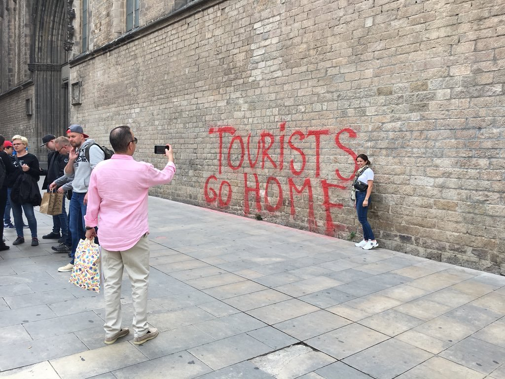

Tourists go home - такие надписи на стенах все чаще мелькают в новостях. Обычная реакция со стороны этих самых туристов и непричастных, но считающих себя трезво мыслящими людей: “Да вы тут в своей Барселоне-Майорке-Канарах без туристов с голоду помрете!”. Попробую сформулировать свои наблюдения.

## Постановка вопроса

Сразу: важно определиться с предметом спора. Я прекрасно понимаю, что есть места, где туризм - основа местной экономики (та же Майорка). Я понимаю, что протест на самом деле - против возросшей стоимости жизни, в основном против цен на жилье, которые действительно могут расти из-за того, что большое количество жилья сдается этим самым туристам на краткосрок. Да, я прекрасно понимаю, что некоторые протестующие могут не до конца понимать важность денежных поступлений от туристов местным бизнесам и напрямую в казну. Идиотов вокруг вообще хватает. Но. Я лишь хочу донести мысль, что **есть люди, которые протестуют совершенно осознанно, что их позиция абсолютно логична и что интересно было бы посмотреть на ситуацию их глазами**.

## Bowen Island

Рядом с Ванкувером есть такой небольшой островок, живет на нем около 6 тысяч. Постоянно жить на острове люди относительно массово начали лет сто назад. С большой землей его связывает паром примерно на 100 легковых машин, ходящий примерно раз в час. Население острова - в основном небедные люди, которым работать либо не надо, либо они работают удаленно, либо готовы кататься на пароме на материк на работу. Если не брать в расчет немногочисленных госслужащих (библиотекарь, учителя в местной школе, сотрудники местных парков), то экономическая активность на острове невысокая. Она связана либо со строительством и обслуживанием-ремонтом домов (арбористы, плотники, сантехники, ассенизаторы) либо с туристами-развлечениями: поесть, выпить, поиграть в гольф, поплавать на каяках. Гостиниц в традиционном понимании на острове нет, но есть немногочисленные B&B и сдаваемые всерую комнаты или дома. На острове два небольших продовольственных магазина, оба около парома. У них конкуренция, которая со стороны вроде выглядит вполне здоровой.

В выходные, особенно если хорошая погода, на остров приплывают тысячи отдыхающих с материка. В такие дни поездку туда и обратно нужно тщательно планировать, иначе велик шанс простоять в машине в очередях несколько часов.

Есть планы построить до острова мосты и пустить через остров быструю дорогу, чтобы соединить материк с отдаленным участком суши, до которого сейчас можно добраться только по воде - по суше там слишком сложный рельеф. Но местное население категорически против таких планов, вплоть до простестов и включения связей в высоких кабинетах (напоминаю, на острове много old money, пусть это не супер-состояния, но старые связи и деньги есть). Несколько лет назад в очередной раз отстояли свой остров, от планов построить мост через их остров (пока?) отказались.

Казалось бы - если через остров пройдет дорога, то туристов там станет во много раз больше, бизнес там попрет, как на дрожжах, и уже недешевые дома будут продаваться за совсем безумные деньги, местное население будет плясать качучу. Но им этого не надо. **Не надо больше двух магазинов, больше одного фельдшера. Автосервисов не надо вообще. И они прекрасно осознают, чего хотят. Они пытаются сохранить там свой образ жизни.** Из разговоров с ними иногда складывается впечатление, что люди просто не заметили, как изменился мир за последние лет тридцать, но это уже другая тема. Они там счастливы (ну, или по крайней мере убеждают себя в этом) и не нужна им эта туристическая движуха.

## Point Grey

Район Ванкувера, один из самых дорогих. Местные богатенькие буратины очень противились постройке метро в их районе. Метро в нашем случае это: многоэтажное жилье вокруг станций, бизнес-активность, толпы заезжающих сюда по делам или развлечься из других районов. Самое интересное: постройка метро традиционно повышает цену земли в округе, то есть эти буратины технически могли бы стать еще богаче. Дом живущего там основателя компании Lululemon мог бы вырасти за несколько лет с условных 50 до 100 миллионов. Собственно, такие голоса слышны, мол, вы идиоты, вам же лучше будет, ваша недвижимость попрет вверх.

Но им этого не надо. Они в этих домах хотят состариться и умереть, и не надо им лишней суеты около дома. И денег такой ценой им не надо, потому что к таким деньгам в нагрузку идет трафик, преступность и мусор. То есть опять же вполне осознанный протест.

Если отсюда вернуться к теме условной Барселоны - далеко не все аборигены являются выгодоприобретателями от туризма. **Для многих аборигенов бенефиты от туризма в виде поступлений в местный бюджет и большого выбора мест, где можно выпить, не перевешивают неудобства в виде запредельной цены на жилье, возросшей преступности и мусора.**

## Майорка

Хорошо, попробуем пример местечка, где туризм - основная статья экономики. Условные Канары и Майорка.

**Я уверен, что даже там есть люди, которые были бы не против "закрыть остров".** Им с этого роста ввп может, и не достается ничего, кроме ненужного геморроя. Канализирование недовольства на туристов - да, есть такое дело. Во многом это иррациональное. Но абсолютно так же иррационален мейнстримный плач о том, что без туристов у них там все развалится.

Доходы владельцев некоторых бизнесов либо хорошо масштабируются за счет туристов  (рестораны, например), либо 100% ориентированы на туристов (экскурсионные бюро, владельцы краткосрока, например). Через эти бизнесы выгодоприобретателями становятся муниципалитеты, которые в идеале всю дельту в доходах, полученных за счет туризма, вложат в инфраструктуру.

Если вот прям завтра все туристы исчезнут, то потенциально заплачут 3 группы аборигенов:
1. Владельцы этих ориентированных на туризм бизнесов и большинство их наемных работников.
2. Местные бюрократы, у которых просядет бюджет.
3. Не связанные с туризмом люди, у которых уменьшится, например, количество работающих в вечерние часы магазинов и станут реже ходить автобусы.

Тут мои оппоненты апеллируют к здравому смыслу группы 3. Я же хочу сказать, что в группе 3 очень много (достаточно, чтоб их стало слышно) людей, которые, взвесив для себя все за и против, решили, что лучше меньше сортов хамона и меньше автобусов, чем вот как сейчас.

**Майорка - не замкнутая экономическая система. Есть еще федеральный (или провинциальный, или оба) бюджет, который обеспечит школы, больницы и паром на котором будут ездить жители и редкие гости, и который привезет пожрать.** Мой канадский опыт учит, что паромы в их нынешнем виде - довольно убыточное дело и спонсируются налогоплательщиком. Турпоток не делает паром прибыльным, если только рядом не пустить еще одну, коммерческую линию уже за реальные деньги. Думаю, что в Испании с ее социализмом - так же.

Если бы Майорка была отдельным государством, то да, группа 3, конечно, взвыла бы в полном составе. Тут привет Мальдивам, у которых доходы от туризма под 40% от ВНП. **Именно поэтому мы ничего не слышали про анти-туристические протесты на Мальдивах. Там действительно аборигены сильно заскучают без туристов.** А с Майоркой не так просто.  

Итак, туристы исчезли. Ушли рестораторы и владельцы краткосрока, а вместе с ними и официанты и горничные. Соответственно, стало меньше работы для сантехников и мастеров-на-все-руки (кстати, вряд ли они ходят на протесты против туристов на Майорке, думаю, они скорее из когорты туристозависимых). Кому-то из них придется переквалифицироваться или уехать. Допустим, половина грузовиков и микроавтобусов на острове сейчас перевозит жратву для туристов, и с уходом туристов эти грузовики пропадут. Останется та часть, которая перевозит продукты и барахло между полями, магазинами и паромом. Хорошо, эта половина тоже слегка усохнет потому что спрос на еду в магазинах тоже упадет. Но полностью грузоперевозки не умрут. Да, у автомехаников, обслуживающих грузовики и прокатные машины, будет заметно меньше работы. И так далее. Но “меньше” не значит “конец света”, см. пример с Bowen Island. Хорошо, можно даже применить термин “локальный экономический коллапс” (действительно, валовый продукт региона уменьшится в разы). Но еще раз - есть местные, которые не без оснований считают, что их качество жизни от этого лишь улучшится. 
 
На Канарах успешно [обналичила патриотическую тему депутат Елена Исинбаева](https://www.canarianweekly.com/posts/Yelena-Isinbayeva-Major-of-the-Russian-Armed-Forces-found-in-Tenerife), прикупив там неплохой домик. И таких там довольно много. Ну не верю я, что они без ума от туристов. Если вследствие ухода туристов они получают спокойную жизнь, но им придется мириться с самолетом в Мадрид не пять раз в день, а один, то они вряд ли будут против.  

**Нельзя отказываться признавать существование группы местных, которые ну никак не заинтересованы в экономическом росте региона за счет туристов.** Которые реально хотят жить в глуши (да что уж там, пугать так пугать -  в “дотационном регионе”). Как при бабушке. У которых источники дохода никак не связаны с туристами: пенсы, госслужащие типа учителей и пожарных, удаленщики, да, наконец, те же фермеры, которые в силу сложности производственных цепочек или особенностей рынка не могут рассчитывать на туристов - например, на Майорке полно оливковых ферм, но основной потребитель на материке. Которые считают, что  побочные эффекты от присутствия туристов сводят на нет все экономические плюсы от них.

## И?

Экономику я представляю как игру, где  каждый играет за себя, а не с целью поднять ввп страны или региона. Протестующие пытаются действовать в своих интересах, а не в интересах родины. Если протестующих становится слышно, то это значит, что они есть. **Можно пытаться им доказать, что они идиоты, но сначала было бы неплохо их внимательно выслушать.** Совершенно необязательно следовать их хотелкам, но вот так сразу объявлять их идиотами - это опрометчиво.

